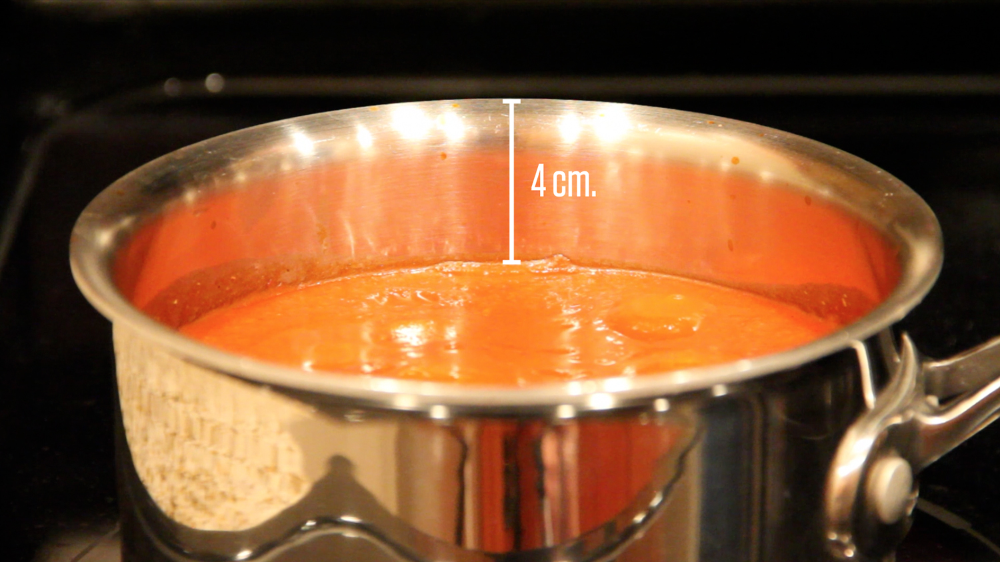
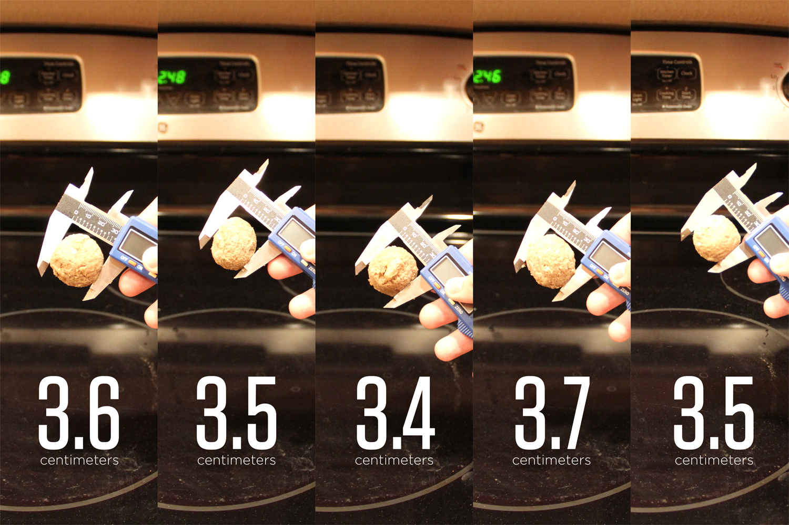
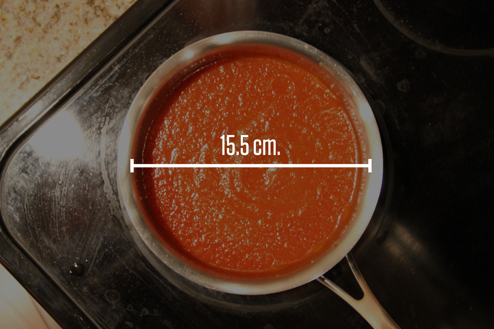

# Kjøttboller

Tanken bak 3-act-math er at elevene presenteres for scenario i form av et bilde eller en liten filmsnutt. Scenen er satt, men det gis ingen føringer eller problemstillinger. Hva tenker dere? Hva lurer dere på? Alt er lov. I fellesskap skrives alle spørsmål opp. Kanskje dukker det opp spørsmål som læreren ikke tenkte på. Det er bare fint. I første akt skal vi pirre nysgjerrigheten og snakke om det vi har sett og lurer på.

Vi har nå mange spørsmål. Noen kan kanskje enkelt besvares mens andre ikke er så åpenbare. Vi er klare for andre akt! Vi tar ett spørsmål av gangen. Det er viktig å ha fokus. Hva trenger vi av informasjon for å finne ut av problemstillingen? Diskuter og skriv opp. Gjett! Hva er åpenbart helt feil, for stort, for lite. Eliminer. Finnes det matematiske begreper som passer? Hvilke matematiske verktøy kan brukes? Få alle med. Når all informasjon for å løse problemt er på plass, og først da deles denne ut og man kan regne ut et svar.

Tredje akt er viktig. Dette er selve crescendioet! Har man jobbet hardt og stått på i første og andre akt, så kommer nå belønningen. Traff vi målet? Har vi tenkt riktig? Det er på tide å sjekke om vårt svar stemmer. Fasiten vises som et bilde eller en filmsnutt.

**Første akt**

Vis filmen. Den kan godt vises flere ganger. Ikke gi noen føringer. Hva tenker elevene når de ser denne. Kanskje lurer elevene på noe som gjør at oppgaven får en ny og interessant vinkling. Fokuser på riktig bruk av begreper.

<iframe src="https://player.vimeo.com/video/70264988" width="640" height="360" frameborder="0" allow="autoplay; fullscreen" allowfullscreen></iframe>

<a href="https://vimeo.com/70264988">Meatballs &ndash;&nbsp;Act One</a> from <a href="https://vimeo.com/ddmeyer">Dan Meyer</a> on <a href="https://vimeo.com">Vimeo</a>.

Skriv ned spøsmål som elevene kommer med. Kom gjerne med oppfølgingsspørsmål for å drive klassen videre.

- Vil det renne over?
- Hvor mange kjøttboller skal til før det renner over?
- Hvor mange kjøttboller får det garantert til å flyte over?
- Hvor mange kjøttboller får det garantert **ikke** til å flyte over?

**Andre akt**

Ta utgangspunkt i spørsmålene som elevene har stilt. Velg ut noen dere ønsker svar på. Dette kan gjøres ved en avstemning, eller kanskje alle kan besvares.

Det viktigste i andre akt er at elevene skal komme fram til hva de trenger av informasjon for å få svar på spørsmålene fra første akt. Ikke gi ut noe informasjon før elevene konkret ber om det. Bruk fagbegreper! Dette kan også være et greit tidspunkt å opplyse om uttrykket for volum av sylinder og kule.

Eksempler på informasjon som kan deles ut:

Høyde:

Diameter på kjøttbollene:

Diameter på gryta

Antall kjøttboller:

**Tredje akt**

Dette er det store øyeblikket. Vi skal nå sjekke om våre beregninger stemmer!
<iframe src="https://player.vimeo.com/video/70264989" width="640" height="360" frameborder="0" allow="autoplay; fullscreen" allowfullscreen></iframe>

<a href="https://vimeo.com/70264989">Meatballs &ndash;&nbsp;Act Three</a> from <a href="https://vimeo.com/ddmeyer">Dan Meyer</a> on <a href="https://vimeo.com">Vimeo</a>.

Oppgaven er laget av [Dan Meyer](http://www.101qs.com/2352-meatballs), og tilpasset til norsk av Tom Jarle Christiansen, lisens CC-BY 3.0
